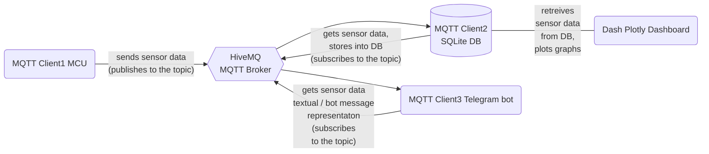

## Sending Real-Time Home Environment Monitoring Data to the Telegram Bot
*(in progress)*

**This project is a practical part of the “Applied IoT” summer course offered by Linnaeus University (23ST - 1DT305).**

 



  

 https://github.com/juliazubko/Sensor-Data-to-Telegram-Bot/assets/102211232/bccf72ea-18f6-4ef1-930f-5c192e46bca4 

This project aims to develop an autonomous, IoT-based home environment monitoring system using a Raspberry Pi Pico WH microcontroller unit (MCU) and various sensors, with a design that allows for sensor data to be displayed via a Telegram bot upon user demand.

The current setup involves a DHT11 digital temperature and humidity sensor and a MCP9700 TO-92 analogue temperature sensor. Sensor data is transmitted via Wi-Fi, using MQTT communication protocol, to an online HiveMQ broker. 

A Telegram bot currently offers real-time sensor data on request. Future enhancements include expanding its capabilities to display insightful plots or dashboards and to trigger specific actions on the MCU through bot commands.

The eventual goal is to run the system on battery power and a local MQTT broker, potentially bypassing the need for the Broker-to-SQL + SQL-to-Dash process (considering the option to deliver data visualizations  via the Telegram bot). 

## Short Specifications

| Material                                             | Description                                                                                                                     |
|--------------------------------------------------|-----------------------------------------------------------------------------------------------------------------------------|
| Raspberry Pi Pico WH                        | RP2040 CPU, ARM Cortex-M0+ 133MHz, 256kB RAM, 30 GPIO pins, 2MB on-board QSPI Flash, CYW43439 wireless chip, IEEE 802.11 b/g/n wireless LAN, delivered with soldered 40-pin header |
| Breadboard with 840 Connection Points | Breadboard with 840 connection points                                                                                            |
| USB Cable A-Male to Micro B 5-Pin Male, 1.8m | USB cable, A-male to micro B 5-pin male, 1.8m                                                                                   |
| 20-Pack of Jumper Wires, 30cm, Male-to-Male | 20-pack of jumper wires, 30cm, male-to-male                                                                                     |
| Digital Temperature and Humidity Sensor DHT11   | A sensor module that measures temperature and relative humidity. [DHT11 datasheet](https://www.electrokit.com/upload/product/41015/41015728/DHT11.pdf) |
| MCP9700 TO-92 Temperature Sensor             | A low-power linear active thermistor. [MCP9700 TO-92 datasheet](https://www.electrokit.com/upload/product/41011/41011628/21942e-2.pdf)  |


## VSCode + PyMakr Extension Installation

Program the device with VSCode (Windows 11 here), using the PyMakr extension for MicroPython. Setup steps are:

-  Download and install [Node.js](https://nodejs.org/en/download)
-  Download and install [VS Code](https://code.visualstudio.com/download)
-  Open VS Code and then the Extensions manager. You can access it from the left panel icon, from View >> Extensions, or by pressing `Ctrl+Shift+X`.
-  Look for PyMakr and install it.

**For more detailed instructions and additional steps, please follow the [tutorial](https://hackmd.io/@lnu-iot/rkiTJj8O9) prepared by the teaching  staff of the Linnaeus University "Applied IoT" summer 2023 course.** 

## Updating Firmware on Raspberry Pi Pico WH

- Start by downloading the MicroPython firmware from the following website: [https://micropython.org/download/rp2-pico-w/](https://micropython.org/download/rp2-pico-w/). Ensure you select the most recent version under the "Releases" section, rather than opting for the "Nightly Builds".
- Next, insert the micro-USB end of your cable (the smaller side) into the Raspberry Pi Pico. Take care to hold the back of the USB slot to prevent any potential bending.
- With the BOOTSEL button held down on the board, plug the USB Type-A end of your cable (the larger side) into a USB port on your computer. After the cable is connected to your computer, you can let go of the BOOTSEL button.
- You should now see a new drive labeled "RPI-RP2" in your file explorer. This represents the Raspberry Pi Pico storage. Copy the uf2 file into this drive.
- Wait for the board to disconnect and then reconnect to your computer automatically.

**Note:** Do not remove the device from your computer while the firmware is installing. Doing this could corrupt the firmware, making it necessary to repeat the previous steps.


## Running a Test Code

Open VSC and follow the steps:
- In the left toolbar, press the Pymakr badge and connect your Pico. A prompt such as 'Serial USB (COM 3...' should pop up under Pymakr devices.
- Hover the mouse over 'Serial USB (COM 3...', and press the flash icon (Connect device).
- Press 'Create terminal' icon (a square with a `>` inside). Once terminal created, after `>>>`, print something to see if your board is connected. For example, type `print('hi')`, your board should reply with 'hi' (REPL).
- In the Pymakr 'Projects', press create project and choose your project's destination folder.
- An empty project will appear, press ADD DEVICES, choose your 'Serial USB (COM...)...', press OK.
- Hover your mouse over Empty project, press 'Start development mode' `</>`. This mode will automatically upload/delete changed files and restart your device.
- Go to the file explorer in your VSC (the very upper badge in the left toolbar) and choose `main.py`. Add the following code:

```python
    import time
    import machine as m

    led = m.Pin("LED", m.Pin.OUT)

    while True:
        led.toggle()
        time.sleep(2)       # Delay for 2 seconds
```


<tbc...>

- Connecting MCP9700 TO-92 to Raspberry Pi Pico WH RP2040 + MicroPython code for reading MCP9700 TO-92 sensor data:  **[tutorial](https://hackmd.io/@lnu-iot/r1hUdtzI3)**
- Connecting DHT11 to Raspberry Pi Pico WH RP2040 + MicroPython code to read its data: **[repository](https://github.com/iot-lnu/applied-iot/blob/master/Raspberry%20Pi%20Pico%20(W)%20Micropython/sensor-examples/P5_DHT_11_DHT_22/main.py)**.
- The `MQTTClient` **[Cloned from here](https://github.com/fizista/micropython-umqtt.simple2/blob/master/src/umqtt/simple2.py)**

<tbc..> 

**See full description at https://hackmd.io/@iz222br/BJLkNrbY2**  


